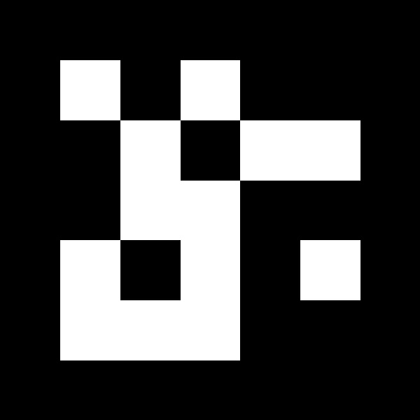

# Coordinate
We are using Aruco Marker for defining center of the world. We are using Aruco Marker ID 0 from configuration 5x5, 250

A printable PDF version can be found at [https://drive.google.com/file/d/1QtufqHznFYSQKumHuKppixglUSEPIFkc/view?usp=sharing](https://drive.google.com/file/d/1QtufqHznFYSQKumHuKppixglUSEPIFkc/view?usp=sharing).

A cleaner version (recommended) is

---

# Localization Module
The localization module in ROAR offers the global coordinate of the vehicle at real time with __ARUCO Marker__ and two cameras on the vehicle (`D435i` and `t265`). You can check out an introduction and setup instruction video from below:

Some other resources include:

- [the slides for the presentation](https://docs.google.com/presentation/d/1AiIONX9xVkLnRtfx0adKu766J9bmoCrDsh6krlKlx6U/edit?usp=sharing)
- [earlier discussion on some features of the t-camera (implementation details)](https://docs.google.com/presentation/d/1WNjhru-0grSEbsdWh5imRE69l2kXfN2KM4JJmbEiceU/edit?usp=sharing)