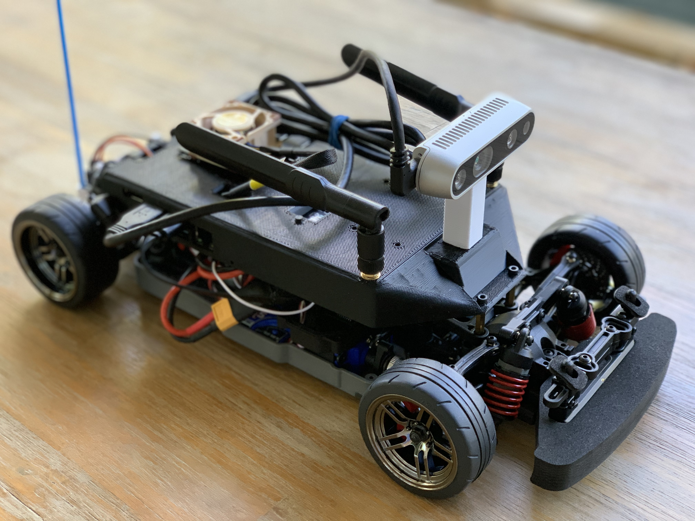

# Welcome to ROAR

# **Documentation for ROAR-Simulator**

## Quick Links

* If you are new to the project visit [Quick Start](#quick-start)
* If you are curious about ROAR Competition at Berkeley visit [Berkeley ROAR](https://vivecenter.berkeley.edu/research1/roar/)
* If you are curious about Carla visit [Carla Simulator](https://carla.org)
* For more information regarding DeCal Course visit [Roar Decal](https://roar-decal.github.io/ROAR.html).

    
## Contribute To ROAR Guide
### Communication
Before starting a new contribution, it is important to let the community know what you plan on doing. This serves several purposes.

1. It lets everyone know that you are going to start work on a feature or bug fix so that no one else does the same and duplicates your effort.
2. It lets anyone who may already be working on the feature or bug fix know you intend to work on it, so they can tell you and you don't duplicate their effort.
3. It gives others a chance to provide more information about what the feature or bug fix might need or how it may need to be implemented.

You can let the community know by first opening an Issue on Github. An admin will tag a related Pull Request if this is a duplicated issue

### Documentation Style
We use [mkdocs](https://www.mkdocs.org/) and [mkdocstrings](https://github.com/pawamoy/mkdocstrings) to automatically generate documentation. 
This means that we require all Python code documentation to be written in Google Style

The recommended method for enabling automatic Google Docstring framework generation is through PyCharm. Here's a [tutorial](https://intellij-support.jetbrains.com/hc/en-us/community/posts/360000218290-Configure-google-docstring) on how to enable this feature in PyCharm 

### Pull Request Style
We ask that you fill out the pull request template as indicated in Github, to provide as much details as possible. 

### Issue Style
We ask that you fill out the correct issue template as indicated on Github. 
